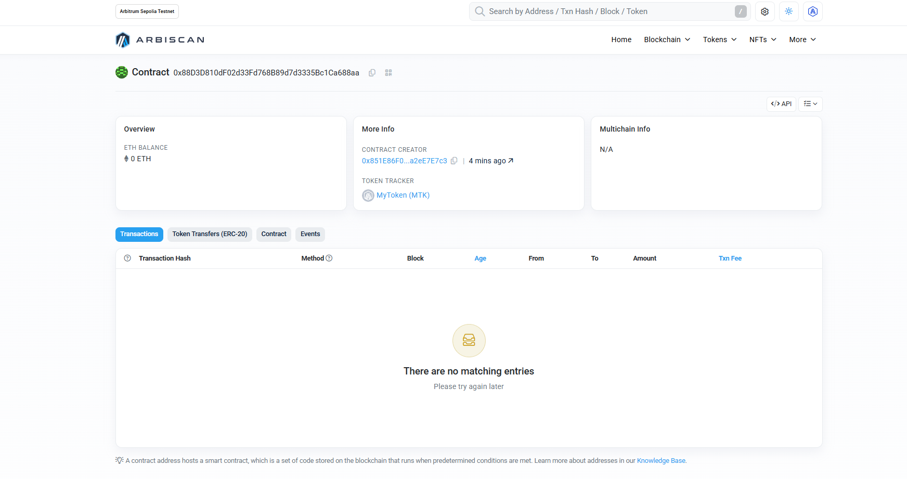

# MyToken (MTK) — ERC20 Token Project

## Overview

An ERC20 token built with Solidity using OpenZeppelin libraries, deployed and tested with Hardhat.

- **Token Name:** MyToken
- **Symbol:** MTK
- **Initial Supply:** 1,000,000 MTK
- **Features:** Minting (owner-only), transfers, balance checks

## Deliverables

### 1. Solidity Contract — `contracts/MyToken.sol`

ERC20 token inheriting from OpenZeppelin's `ERC20` and `Ownable`:
- Mints initial supply to deployer
- `mint(address to, uint256 amount)` — owner-only minting function

### 2. Deployment Script — `scripts/deploy.js`

Deploys MyToken with 1,000,000 MTK initial supply using Hardhat/Ethers.

### 3. Test Cases — `test/MyToken.test.js`

| Test | Description |
|------|-------------|
| Deploy with correct initial supply | Verifies deployer receives full initial supply |
| Transfer tokens between accounts | Confirms basic ERC20 transfer works |
| Fail on insufficient balance transfer | Reverts when sender has 0 balance |
| Fail on over-balance transfer | Reverts when sending more than owned |
| Owner can mint | Owner successfully mints new tokens |
| Non-owner cannot mint | Reverts when non-owner tries to mint |

### 4. Deployed Contract

> **Contract Address:** `0x88D3D810dF02d33Fd768B89d7d3335Bc1Ca688aa`
>
> **Network:** Arbitrum Sepolia
>
> **Block Explorer Link:** https://sepolia.arbiscan.io/address/0x88D3D810dF02d33Fd768B89d7d3335Bc1Ca688aa

![Block Explorer Screenshot]
