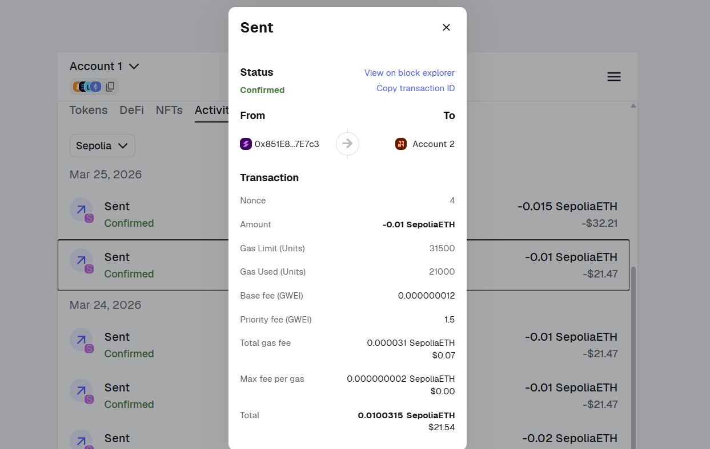
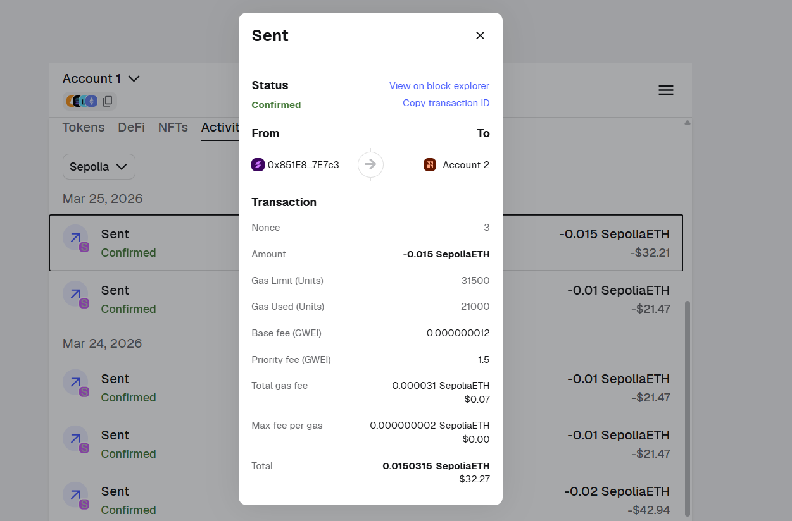
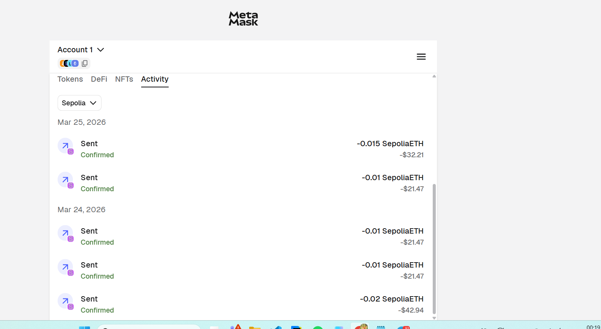

# Crypto HW-3

### 1. Metamask address

```
0x851E86F03b4109bc4890669A6a3Be99a2eE7E7c3
```

---

## Chains

- [Sepolia Transaction](https://sepolia.etherscan.io/tx/0x352e979b9dfd4b9b857f910148f410f0c1225043ee3ee76f1af62209d1c03bcf)

---

## Transactions

- [Transaction Link](https://sepolia.etherscan.io/tx/0x981bf8533dcbaead5987a6203f93e4bf6c80e3f3baf9a9c2a28b2501a658f1ad)

---

## Gas

- **Mainnet**: [Arbitrum Gas Tracker](https://arbiscan.io/gastracker) — трекер газа для основной сети

- **Testnet**: [Arbitrum Sepolia Gas Tracker](https://arbitrum-sepolia.blockscout.com/gas-tracker) — трекер газа для тестовой сети

---

## Nonce

- **Higher Nonce**: [Higher Nonce Transaction](https://sepolia.etherscan.io/tx/0xdb1705a475ce5ad55a64b0e4a53ff3c5e3bb7ec55b2d60a2b3fe3e97253ed3b5)

- **Lower Nonce**: [Lower Nonce Transaction](https://sepolia.etherscan.io/tx/0xb4b4279be54a7a9545bbcef88960a42903afcdd2d73312de91759cb89b94da51)

---

## Screenshots





