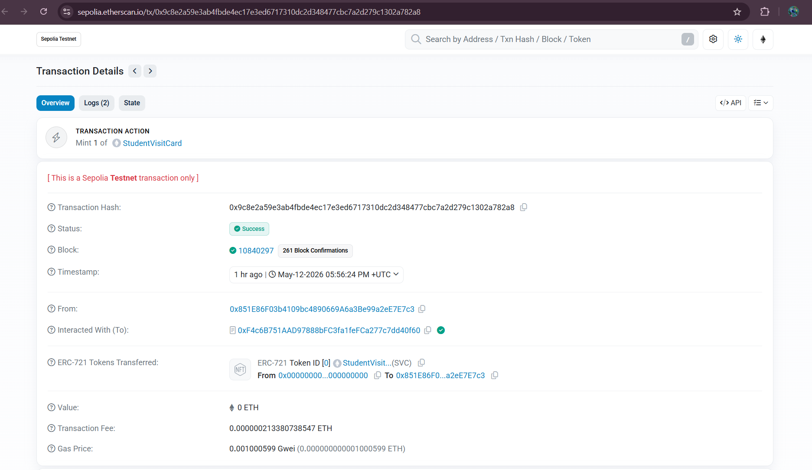
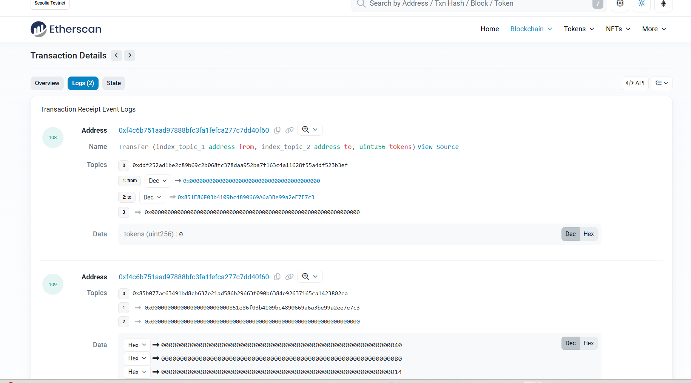
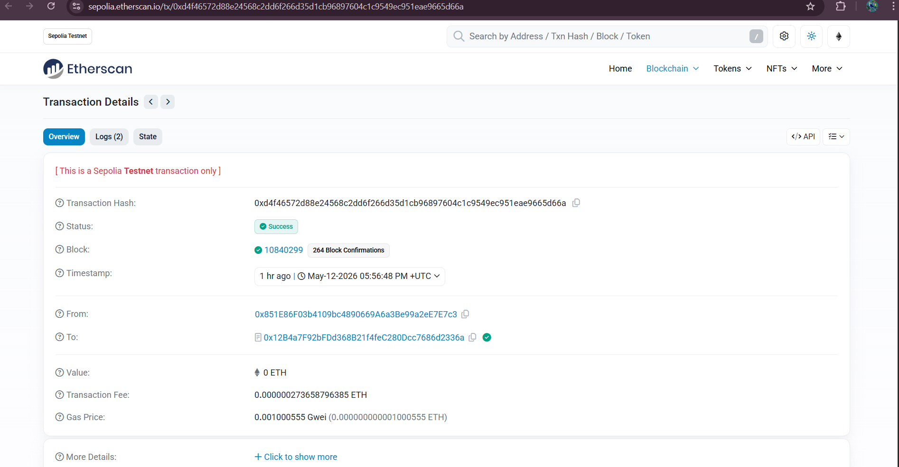
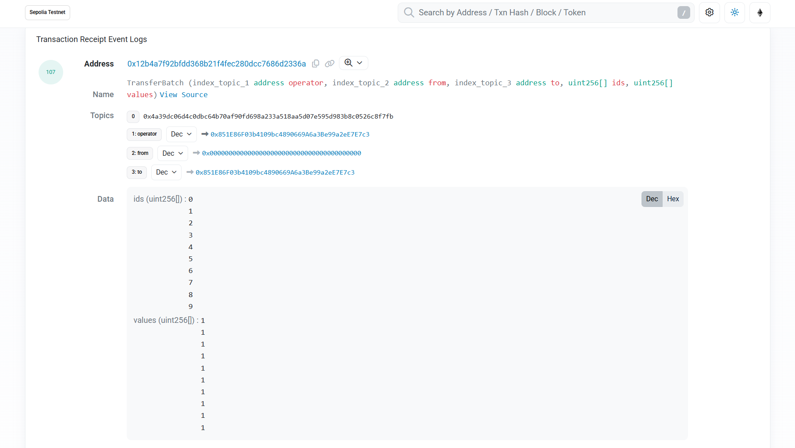
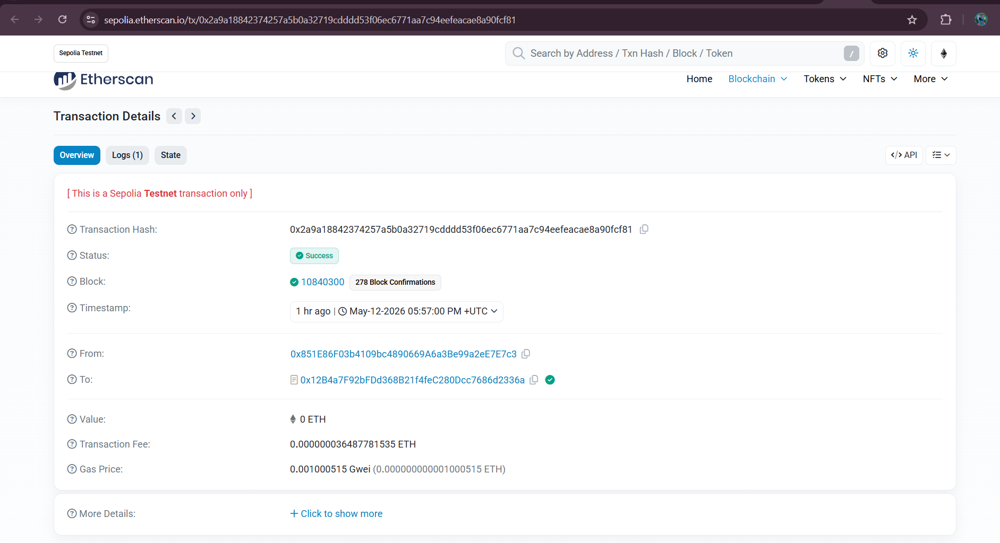
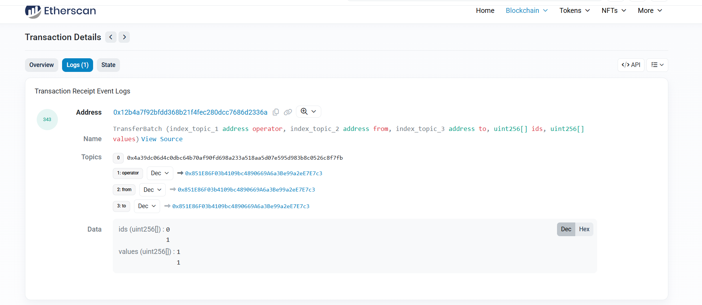
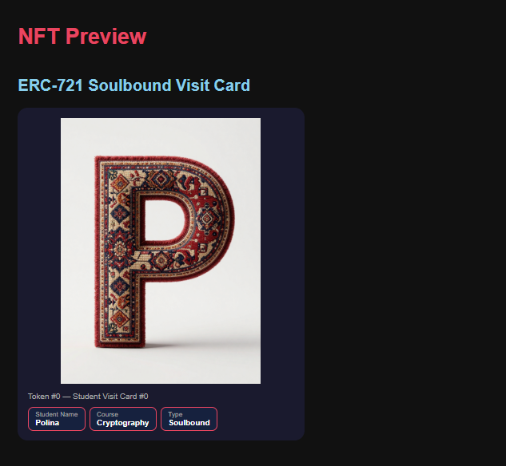
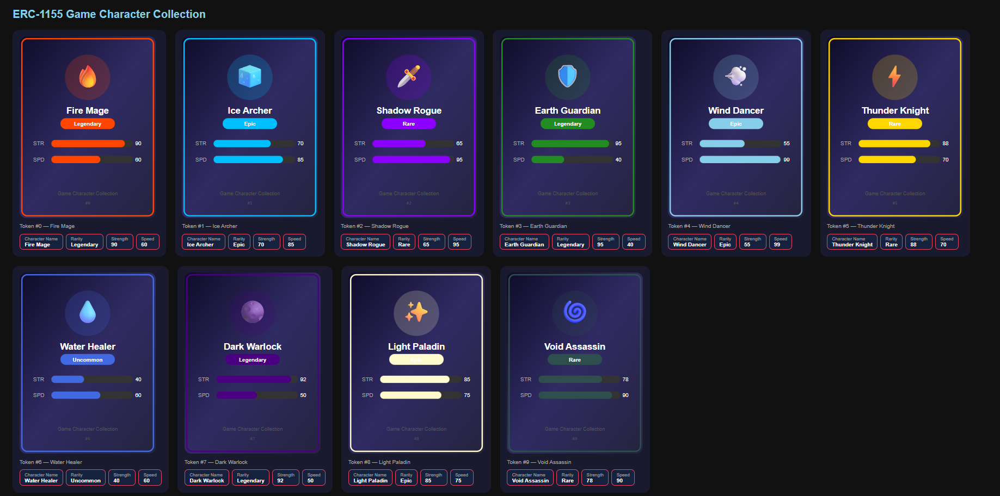
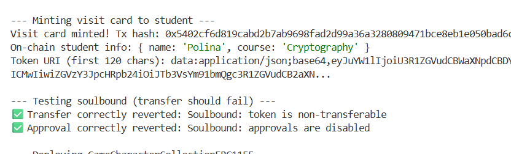

# Cryptography Assignment — NFT Smart Contracts

## Overview

This project contains two Solidity smart contracts:

| Contract | Standard | Purpose |
|---|---|---|
| `SoulboundVisitCardERC721.sol` | ERC-721 | Non-transferable (soulbound) student visit card NFT |
| `GameCharacterCollectionERC1155.sol` | ERC-1155 | Collection of 10 game character NFTs with batch operations |

Both contracts are built on **OpenZeppelin v5** audited implementations with **Solidity 0.8.28**.

**Key feature:** The ERC-721 visit card uses a custom image hosted on **IPFS** (via Pinata). The ERC-1155 game characters use **on-chain SVG** images generated directly in the smart contract. The `tokenURI` / `uri` functions return `data:` URIs with Base64-encoded JSON metadata.

---

## Prerequisites

- **Node.js** v18+ and **npm**
- **Hardhat** (installed as dev dependency)

All dependencies are already listed in `package.json`.

---

## Setup

```bash
# Install all dependencies
npm install

# (Optional) For Sepolia deployment, copy and fill .env
cp .env.example .env
```

---

## Compile Contracts

```bash
npx hardhat compile
```

---

## Run Deployment Script (Local Hardhat Network)

The deployment script deploys both contracts, mints tokens, and demonstrates all functionality:

```bash
npx hardhat run scripts/deploy.js
```

This script will:
1. Deploy `SoulboundVisitCardERC721` and mint 1 visit card to a student wallet
2. Verify soulbound behavior (transfer and approval reverts)
3. Deploy `GameCharacterCollectionERC1155` and batch-mint all 10 characters
4. Batch-transfer 2 characters to the student's wallet
5. Print all balances and character attributes
6. **Generate `nft-preview/index.html`** — open it in a browser to view all SVG images!

---

## Viewing NFT Images

After running the deploy script, open the generated file in your browser:

```
nft-preview/index.html
```

This HTML page decodes the on-chain `data:` URIs and renders all 11 NFT images (1 visit card + 10 characters).

---

## Contract Details

### 1. SoulboundVisitCardERC721

**What it does:**
- Mints exactly **one unique NFT per student** representing their visit card
- Token is **soulbound** — cannot be transferred or approved after minting
- Stores student metadata on-chain (struct) and generates SVG image dynamically
- `tokenURI()` returns a fully on-chain `data:application/json;base64,...` URI

**Soulbound enforcement:**
- `_update()` is overridden to revert on any transfer where `from != address(0)` (i.e., every transfer except the initial mint)
- `approve()` and `setApprovalForAll()` are overridden to always revert

**Key functions:**
| Function | Access | Description |
|---|---|---|
| `mintVisitCard(student, name, course)` | Owner only | Mints one soulbound NFT to the student |
| `getStudentInfo(tokenId)` | Public | Returns on-chain student metadata |
| `tokenURI(tokenId)` | Public | Returns on-chain metadata + SVG image (data URI) |
| `totalMinted()` | Public | Returns counter of minted cards |

**Minting example (in script):**
```javascript
await visitCard.mintVisitCard(
  studentAddress,
  "Polina",  // studentName
  "Cryptography"           // course
);
```

---

### 2. GameCharacterCollectionERC1155

**What it does:**
- Manages **10 distinct game characters** (token IDs 0–9)
- Each character has on-chain attributes: `characterName`, `rarity`, `strength`, `speed`, `color`
- On-chain SVG image with colored stat bars, emoji icons and rarity badges
- Supports **normal transfers** and **approvals** (not soulbound)
- Demonstrates **batch minting** and **batch transfers** for ERC-1155 efficiency

**Characters:**

| ID | Name | Rarity | STR | SPD | Color |
|---|---|---|---|---|---|
| 0 | Fire Mage | Legendary | 90 | 60 | #ff4500 |
| 1 | Ice Archer | Epic | 70 | 85 | #00bfff |
| 2 | Shadow Rogue | Rare | 65 | 95 | #8b00ff |
| 3 | Earth Guardian | Legendary | 95 | 40 | #228b22 |
| 4 | Wind Dancer | Epic | 55 | 99 | #87ceeb |
| 5 | Thunder Knight | Rare | 88 | 70 | #ffd700 |
| 6 | Water Healer | Uncommon | 40 | 60 | #4169e1 |
| 7 | Dark Warlock | Legendary | 92 | 50 | #4b0082 |
| 8 | Light Paladin | Epic | 85 | 75 | #fffacd |
| 9 | Void Assassin | Rare | 78 | 90 | #2f4f4f |

**Key functions:**
| Function | Access | Description |
|---|---|---|
| `mint(to, id, amount)` | Owner only | Mint a single character type |
| `mintBatch(to, ids, amounts)` | Owner only | Batch-mint multiple characters |
| `safeBatchTransferFrom(from, to, ids, amounts, data)` | Token holder | Batch-transfer tokens |
| `uri(tokenId)` | Public | Returns on-chain metadata + SVG image (data URI) |
| `getCharacter(id)` | Public | Returns on-chain attributes |

**Batch minting example:**
```javascript
const ids    = [0, 1, 2, 3, 4, 5, 6, 7, 8, 9];
const amounts = [1, 1, 1, 1, 1, 1, 1, 1, 1, 1];
await gameChars.mintBatch(deployerAddress, ids, amounts);
```

**Batch transfer example:**
```javascript
await gameChars.safeBatchTransferFrom(
  deployerAddress,
  studentAddress,
  [0, 1],  // transfer characters #0 and #1
  [1, 1],  // one of each
  "0x"
);
```

---

## Metadata Structure

Both contracts generate metadata **fully on-chain** as Base64-encoded JSON with embedded SVG images. No external hosting (IPFS) is needed.

### ERC-721 Visit Card — `tokenURI()` returns:

```json
{
  "name": "Student Visit Card #0",
  "description": "Soulbound student visit card NFT...",
  "image": "ipfs://bafybeigo22ftjpfhs3cilqxhgbc46xhwenc7ymufl2vik4wes3ii7bfj2y",
  "attributes": [
    { "trait_type": "Student Name", "value": "Polina" },
    { "trait_type": "Course", "value": "Cryptography" },
    { "trait_type": "Type", "value": "Soulbound" }
  ]
}
```

- The ERC-721 image is hosted on **IPFS via Pinata**
- CID: `bafybeigo22ftjpfhs3cilqxhgbc46xhwenc7ymufl2vik4wes3ii7bfj2y`
- The image URI is stored in the contract and can be updated by the owner via `setImageURI()`

### ERC-1155 Character — `uri()` returns:

```json
{
  "name": "Fire Mage",
  "description": "Game character NFT from the GameCharacterCollection (ERC-1155).",
  "image": "data:image/svg+xml;base64,...",
  "attributes": [
    { "trait_type": "Character Name", "value": "Fire Mage" },
    { "trait_type": "Rarity", "value": "Legendary" },
    { "trait_type": "Strength", "display_type": "number", "value": 90 },
    { "trait_type": "Speed", "display_type": "number", "value": 60 }
  ]
}
```

- ERC-1155 images are generated **fully on-chain** as SVG graphics
- Each of the 10 characters has a unique SVG with colored stat bars, emoji icon, and rarity badge

Both formats are compatible with **OpenSea** and other NFT marketplaces.

---

## Deploying to Sepolia Testnet

1. Get test ETH from a [Sepolia faucet](https://cloud.google.com/application/web3/faucet)
2. Sign up at [Alchemy](https://www.alchemy.com/) (free) and create an app for Sepolia
3. Copy `.env.example` to `.env` and fill in your values:

```bash
cp .env.example .env
```

Fill in:
- `PRIVATE_KEY` — your MetaMask private key (MetaMask → Account → Account Details → Export Private Key)
- `SEPOLIA_RPC_URL` — your Alchemy Sepolia endpoint URL
- `STUDENT_ADDRESS` — wallet address to receive the NFTs

4. Deploy:
```bash
npx hardhat run scripts/deploy.js --network sepolia
```

**⚠️ Never share your `.env` file or commit it to git!** It's already in `.gitignore`.

---

## Project Structure

```
contracts/
  SoulboundVisitCardERC721.sol      — ERC-721 soulbound visit card (on-chain SVG)
  GameCharacterCollectionERC1155.sol — ERC-1155 game character collection (on-chain SVG)
scripts/
  deploy.js                         — Deployment, minting & demo script
nft-preview/
  index.html                        — (generated) Open in browser to view NFT images
metadata/
  visit-card/0.json                 — Example ERC-721 metadata reference
  characters/0.json ... 9.json      — Example ERC-1155 metadata reference
.env.example                        — Template for environment variables
.gitignore                          — Git ignore rules
hardhat.config.js                   — Hardhat configuration
package.json                        — Dependencies
README.md                           — This file
```

---

## Technologies Used

- Solidity 0.8.28
- Hardhat 2.x
- OpenZeppelin Contracts v5
- ethers.js v6
- On-chain SVG + Base64 metadata (ERC-1155)
- IPFS via Pinata (ERC-721 image)

---

## Proof of Functionality

### Deployed Contracts (Sepolia Testnet)

| Contract | Address | Etherscan |
|---|---|---|
| SoulboundVisitCardERC721 | `0xF4c6B751AAD97888bFC3fa1feFCa277c7dd40f60` | [View on Etherscan](https://sepolia.etherscan.io/address/0xF4c6B751AAD97888bFC3fa1feFCa277c7dd40f60) |
| GameCharacterCollectionERC1155 | `0x12B4a7F92bFDd368B21f4feC280Dcc7686d2336a` | [View on Etherscan](https://sepolia.etherscan.io/address/0x12B4a7F92bFDd368B21f4feC280Dcc7686d2336a) |

### Transaction Hashes

#### 1. Minting Soulbound Visit Card NFT to Student Wallet

- **Tx Hash:** [`0x9c8e2a59e3ab4fbde4ec17e3ed6717310dc2d348477cbc7a2d279c1302a782a8`](https://sepolia.etherscan.io/tx/0x9c8e2a59e3ab4fbde4ec17e3ed6717310dc2d348477cbc7a2d279c1302a782a8)
- **Action:** Minted 1 soulbound visit card (token #0) to student wallet `0x851E86F03b4109bc4890669A6a3Be99a2eE7E7c3`
- **Student Name:** Polina 
- **Course:** Cryptography

**Screenshot:**





#### 2. Batch Minting 10 Game Character NFTs

- **Tx Hash:** [`0xd4f46572d88e24568c2dd6f266d35d1cb96897604c1c9549ec951eae9665d66a`](https://sepolia.etherscan.io/tx/0xd4f46572d88e24568c2dd6f266d35d1cb96897604c1c9549ec951eae9665d66a)
- **Action:** Batch-minted 10 game character NFTs (token IDs 0–9, 1 of each) to the deployer address
- **Demonstrates:** ERC-1155 batch minting efficiency (all 10 tokens minted in a single transaction)

**Screenshot:**




#### 3. Batch Transfer of 2 Characters to Student Wallet

- **Tx Hash:** [`0x2a9a18842374257a5b0a32719cdddd53f06ec6771aa7c94eefeacae8a90fcf81`](https://sepolia.etherscan.io/tx/0x2a9a18842374257a5b0a32719cdddd53f06ec6771aa7c94eefeacae8a90fcf81)
- **Action:** Batch-transferred characters #0 (Fire Mage) and #1 (Ice Archer) to student wallet `0x851E86F03b4109bc4890669A6a3Be99a2eE7E7c3`
- **Demonstrates:** ERC-1155 batch transfer efficiency (2 tokens transferred in a single transaction)

**Screenshot:**





### Final Token Balances

| Token ID | Character | Deployer | Student |
|---|---|---|---|
| 0 | Fire Mage | 0 | 1 |
| 1 | Ice Archer | 0 | 1 |
| 2 | Shadow Rogue | 1 | 0 |
| 3 | Earth Guardian | 1 | 0 |
| 4 | Wind Dancer | 1 | 0 |
| 5 | Thunder Knight | 1 | 0 |
| 6 | Water Healer | 1 | 0 |
| 7 | Dark Warlock | 1 | 0 |
| 8 | Light Paladin | 1 | 0 |
| 9 | Void Assassin | 1 | 0 |

### NFT Image Previews

**Screenshot:**





### Soulbound Behavior Proof

Attempting to transfer or approve the visit card NFT results in a revert:
- `transferFrom()` → reverts with `"Soulbound: token is non-transferable"`
- `approve()` → reverts with `"Soulbound: approvals are disabled"`

**Screenshot:**



**Metamask Screenshot**
![Metamask Proof] (screenshots/metamask-proof.png)