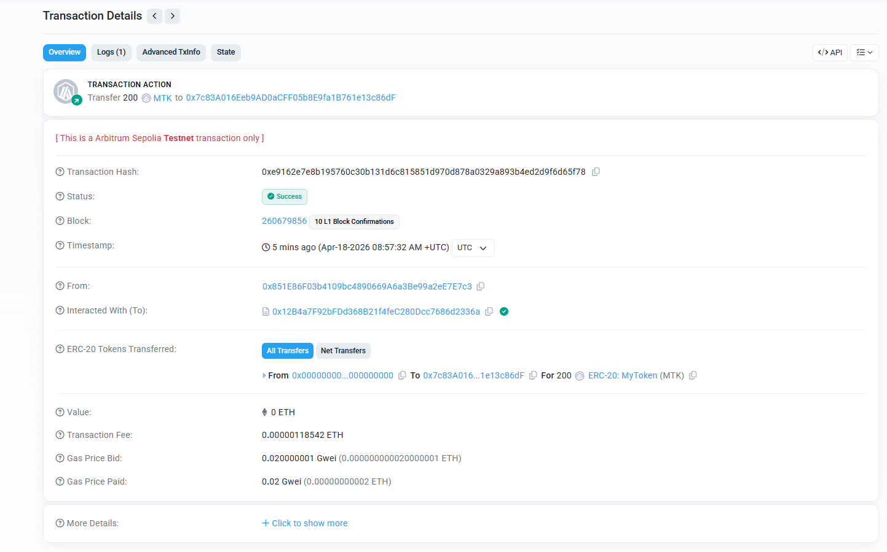
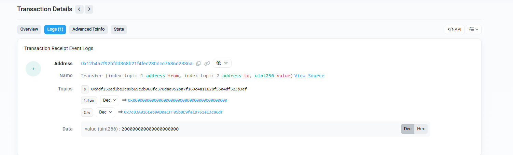
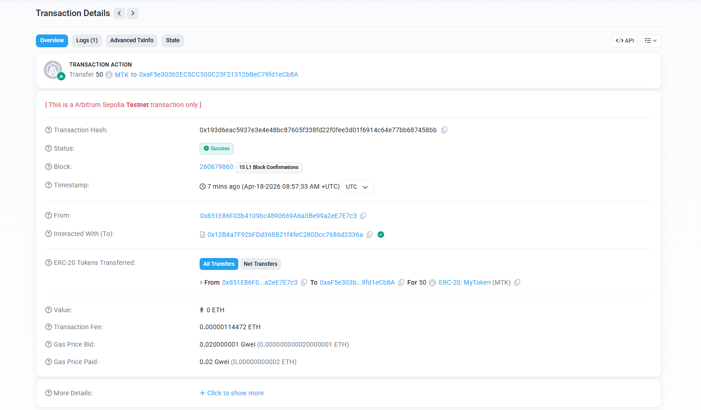
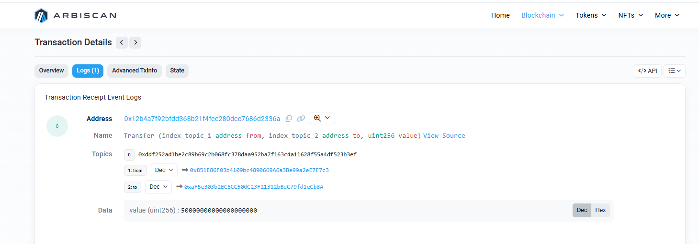
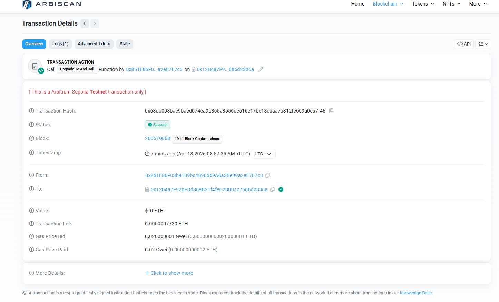
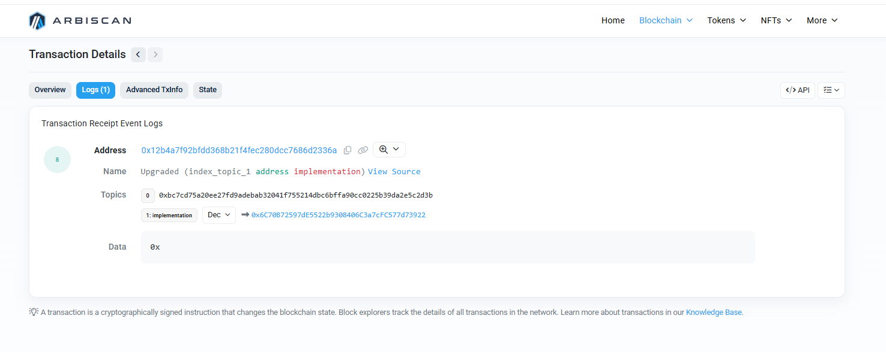
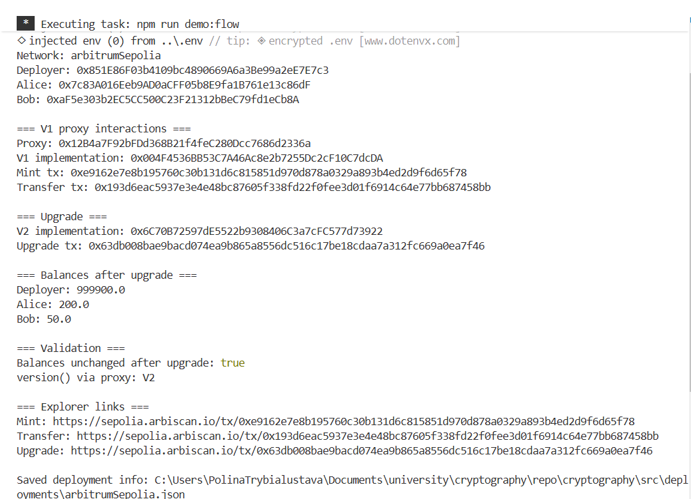

# Upgradeable ERC20 (V1 -> V2) — Report Template

## 1) Task Summary
Implemented upgradeable ERC20 using UUPS pattern with three deliverables:
- ERC20 V1 implementation
- Proxy contract
- ERC20 V2 implementation with `version()` returning `"V2"`

## 2) Contracts and Scripts
- Contracts:
  - [src/contracts/MyTokenV1.sol](src/contracts/MyTokenV1.sol)
  - [src/contracts/MyTokenProxy.sol](src/contracts/MyTokenProxy.sol)
  - [src/contracts/MyTokenV2.sol](src/contracts/MyTokenV2.sol)
- Scripts:
  - [src/scripts/deploy-v1-and-proxy.js](src/scripts/deploy-v1-and-proxy.js)
  - [src/scripts/upgrade-to-v2.js](src/scripts/upgrade-to-v2.js)
  - [src/scripts/demo-flow.js](src/scripts/demo-flow.js)

## 3) Deployment Data (Arbitrum Sepolia)
- Deployer: `0x851E86F03b4109bc4890669A6a3Be99a2eE7E7c3`
- Proxy: `0x12B4a7F92bFDd368B21f4feC280Dcc7686d2336a`
- V1 implementation: `0x004F4536BB53C7A46Ac8e2b7255Dc2cF10C7dcDA`
- V2 implementation: `0x6C70B72597dE5522b9308406C3a7cFC577d73922`

## 4) Evidence (Explorer Links)
- Mint tx (V1 via proxy):
  - https://sepolia.arbiscan.io/tx/0xe9162e7e8b195760c30b131d6c815851d970d878a0329a893b4ed2d9f6d65f78
- Transfer tx (V1 via proxy):
  - https://sepolia.arbiscan.io/tx/0x193d6eac5937e3e4e48bc87605f338fd22f0fee3d01f6914c64e77bb687458bb
- Upgrade tx (proxy -> V2):
  - https://sepolia.arbiscan.io/tx/0x63db008bae9bacd074ea9b865a8556dc516c17be18cdaa7a312fc669a0ea7f46

## 5) Validation Results
- Token minting on V1 proxy: **Successful**
- Token transfer on V1 proxy: **Successful**
- Upgrade transaction: **Successful**
- Token balances after upgrade: **Unchanged**
  - Deployer: `999900.0`
  - Alice: `200.0`
  - Bob: `50.0`
- `version()` through proxy after upgrade: **`V2`**

## 6) Screenshots

Figure 1 — Mint transaction (Overview, Success)


Figure 2 — Mint transaction (Logs / ERC-20 Transfer event)


Figure 3 — Transfer transaction (Overview, Success)


Figure 4 — Transfer transaction (Logs / ERC-20 Transfer event)


Figure 5 — Upgrade transaction (Overview, Success)


Figure 6 — Upgrade transaction details (function call / context)


Figure 7 — Post-upgrade validation logs (balances unchanged, version = V2)



## 7) Commands Used
```bash
cd src
npm test
npm run deploy:v1
npm run upgrade:v2
# or end-to-end:
npm run demo:flow
```

## 8) Conclusion
The project successfully demonstrates ERC20 upgradeability via UUPS proxy. State was preserved after upgrade, and new V2 functionality (`version()`) became available through the same proxy address.